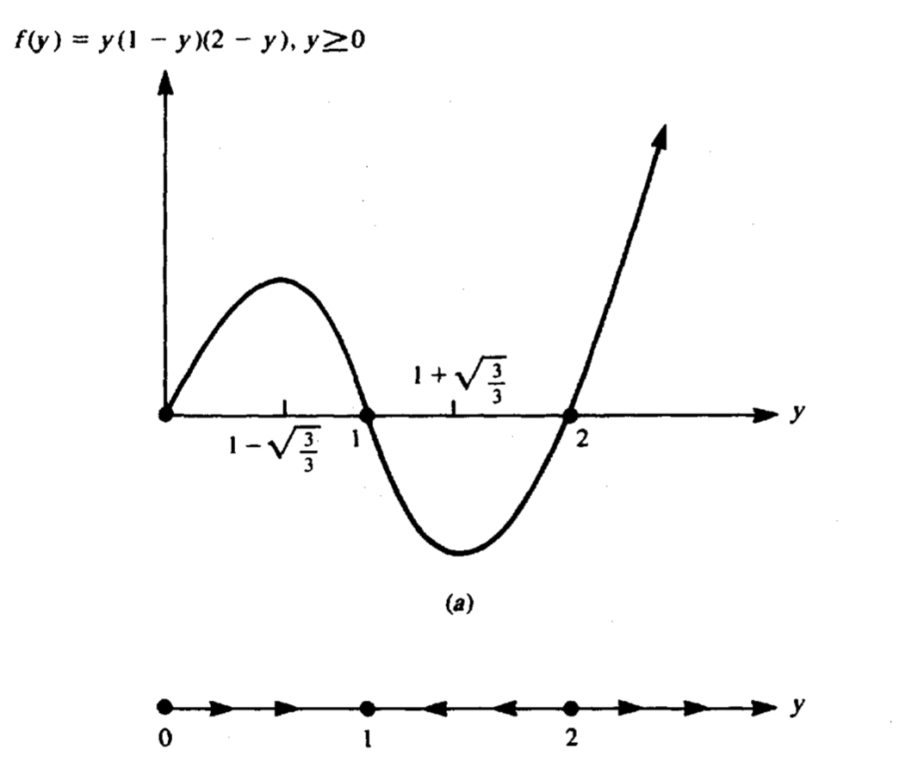
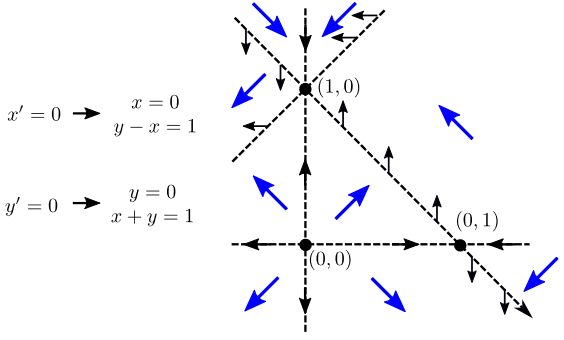

# Math 113B - Math Biology, W23
## Part 1

### Logistics

- Not everyone took MATH113A, but logistics are similar.
- Homework uploaded to Gradescope, due on Fridays.
- Quizzes on Thursdays during discussion.
- One midterm. Final project.
- No participation points.
- Many complained about the book. It's still the best book available. 
- In syllabus, I add references to other books for every topic if you want to consult. I'll also draw homework problems from other books. 
- Feedback last quarter also was that students want more biology. This is tricky. We need to study both model construction (need to learn biology) and model analysis (need to learn math). I'll try to strike a balance. 

## Intro to Continuous Models (Chapter 4 in Edelstein-Keshet)

### Warmup: growth of bacteria

- Suppose we are growing bacteria in a flask.
- We can count how many there are at given times.
- We want to understand (via modeling) how many there are after a certain amount of time. 
- Call $N(t)$ the number of bacteria after time $t=0$. 
- One big caveat of most of the modeling we will do in this class is that  $N(t)$ will take on continuous values. That is, $N(t)$ could be $10.1$. What does this mean if we are counting something?
- Ignoring this for now, how do we model this? 
- In 113A, we used **difference equations**. The idea there was that we think about $N(t)$ at regular time intervals $t_0, t_1, t_2$, where $t_1 = t_0 + \Delta t$ and $t_2 = t_1 + \Delta t$, and relate $N(t_n)$ to $N(t_{n-1})$.  
- The simplest model we might think of is that a single bacterial cell divides, its daughters divide, some die, so on average, each bacteria gives rise to $K$ new ones per time. In this class, we will emphasize the **units** of parameters.
- When we say $K$ has units of rate, that means it is something *per time*. Specifically, it the number of new offspring *per bacteria, per time*. 
-  We would say that - $N(t_{n+1}) = N(t_n) + K N(t)\Delta t$. That is, the new amount of bacteria is the old amount, plus the new amount changed in the time window. 
-  Are the units right? On the left hand side we have number of bacteria. On the right hand side we have  bacteria/(bacteria x time)(bacteria)(time) = bacteria. That looks good.
-  These types of models were fine in ecology when we observe stuff rarely. In cell and molecular biology, technology has facilitated the ability to make observations, in this case, making $\Delta t$ small. 
-  If we rearrange a little, we get
$$
\frac{N(t+\Delta t) - N(t)}{\Delta t} = KN(t).
$$
- We wrote this in a suggestive way. What happens when we take $\lim_{t\to\Delta t}$? The left hand side is exactly the derivative, $\mathrm{d}N/\mathrm{d}t=N'(t)$.
- As the time between observations becomes small, we are left with
  $$ N'(t) = KN(t).$$
- This will be our simplest model of population growth, but it is a nice starting point.
- Despite its simplicity, it is very important! 
- The model is attributed to Robert Malthus in 1798, in one of the first attempts to quantify populations. 
- Quoting Wikipedia: "By now, it is a widely accepted view to analogize Malthusian growth in Ecology to Newton's First Law of uniform motion in physics.
- That is, it is a simple starting point but a nice thing to compare more complex models to.
- What type of equation is this? It is no longer a difference equation, it is a **differential equation**. 
- We can solve differential equations *sometimes* but not usually. In this case, we can solve it. 
- What does it mean to *solve* a differential equation?  
- The equation we have implicitly describes $N(t)$ but it does not explicitly tell you what the population is after 10 days, e.g. $N(10)$. To figure this out, we must solve.
- This differential equation is *separable*. You might remember this trick from Calc 2. We can (not correctly, but it works) think of $\mathrm{d}N/\mathrm{d}t$ as a fraction and rearrange, and integrate:
  $$
  \frac{\mathrm{d}N}{N} = k \mathrm{d} t\\
    \int \frac{\mathrm{d}N}{N} =\int  k \mathrm{d} t\\
    \log N(t) - \log N(0) = kt \\
    N(t) = N(0)e^{kt}.
  $$
  - Equipped with this solution, so long as we know the initial condition $N(0)$, we can predict the population at any future time. That is one advantage of a model. 

- If our prediction is "right" we can feel assured that our model is plausible (but it may not be the only model!)

- If our prediction is "wrong" (compared with say, experimental data), we can conclude that our model is not capturing the right behavior and we might want to rethink it.

- There are lots of variations we could consider here. 

- Should the production rate $K$ stay constant the whole time? 

- What determines $K$? Presumably the bacterial cells need food, and might run out of it?

- Therefore, we could consider $K(t)$ instead. But what do we specify as $K(t)$? 

- Now we need a model for $K(t)$ as well! 

- One simple explanation is that $K$ depends on the *concentration* of the food, so let's say $K = \kappa C$.  

- Our updated population equation would then be 
  $N'(t) = \kappa C N$. But what is $C$? 
  
- We can write down another differential equation for how we think $C$ changes. Suppose we think $\alpha$ units of nutrient are consumed per each unit of bacterial cell change. This translates into $C' = -\alpha   N' = -\alpha \kappa C N$. 

- Now we have a **system** of (coupled) differential equations. The differential equations for $N, C$ both depend on each other. 

- Through a trick that works on no other problem (so don't feel bad if you don't see it), we can integrate
$$
  \int C' = \int -\alpha   N'\\
  C(t) = -\alpha N(t) + C_0,
$$
where  $C(0) = -\alpha N(0) + C_0$.
-  We can substitute this into the equation for $N'$  and we're left with
  $$N' = \kappa (C_0-\alpha N)N.$$
- This is separable! Sparing you the details of integrating it, our solution is
$$
N(t) = \frac{N_0 (C_0/\alpha)}{N_0 + (B-N_0)e^{-\kappa C_0 t}}.
$$
- How does this model behave? As $t$ gets large, We see this population approaches $N(t) \to C_0/\alpha$. This is called the "carrying capacity". 
- Another observation is that if $N_0$ is small, then this approximately grows approximately exponentially, like Malthus predicted.
- It turns out this model works pretty well! See the data and the fit below.

- While I understand it's a bit challenging to discern general lessons from this first warmup, I want to recap what I think some of the lessons are:
    - This class will be about modeling using differential equations.
    - Differential equations are (in my opinion), easier to use, and more mathematically interesting than difference equations. Therefore, these are much more popular in mathematical biology. 
    - They typically take the form of $\text{rate of change in stuff}=\cdots$. 
    - We can construct models based on *hypotheses* about how we think biology works. We then study the model behavior to validate or reject our model. 
    - Most models will not be this simple, so we will need new mathematical tools to study their behavior. This is what our class is about!  

### Another example: the bacterial chemostat

- During our “warmup” chapter, we are just seeing some lessons to motivate what we will study in the rest of the class.

- Next example is a more detailed model of growing bacteria in a chamber or flask. 

  

- If we want to take out bacteria regularly, (for instance, to do experiments, or use in some product), we need to also continuously grow them. One convenient way to do this is to keep them in a chamber and continuously flow in stock nutrients and flow out some bacteria.

- We want to design the system such that 

  - The flow is not so great that all/most bacteria are flowed out
  - The flow is great enough that bacteria do grow

- That is, we want a balance of flowing nutrients in and flowing bacteria out so that we get a stable population of bacteria. Not obvious how to do this without modeling.

- What do we want to model? We have a few variables and parameters.

  - $C$ is the nutrient concentration in the chamber. It has units mass/volume
  - $C_0$ is the concentration in the reservoir, also mass/volume.
  - $N$ is the population *density* of bacteria, number/volume.
  - $V$ is the volume of the chamber.
  - $F$ is the flow in and out, importantly, of units volume/time.
  - $K$ is the reproduction rate of bacteria (per bacteria), in units of 1/time.

- Let’s attempt a model. Let’s assume that the chamber is well stirred so all the bacteria have an equal chance of being removed. Then we can write
  $$
  \frac{dN}{dt}= \text{change in bacteria concentration} = \text{reproduction} - \text{flow out}
  $$

- What are these terms? We can take a guess
  $$
  \frac{dN}{dt}= k N - F N.
  $$

- Now, let us do our unit check. On the left we have change in density over time, this has units of (number)/(volume * time). Everything on the right must have this too. 

- The first time is (1/time) (number/volume), so we are good.

- What about the second term? (volume/time)*(number)/volume = number/time. 

- We accidentally wrote down the NUMBER of bacteria leaving rather than the “density”.

- To fix this, we rescale by the volume and we see the term with the right units is 
  $$
  \text{bacteria concentration flow out} = \frac{FN}{V}.
  $$

- Our units are right, but is our model? Is the reproduction rate constant? Probably not. 

- Call $C$ the concentration of nutrient in the chamber. Then, more likely,
  $$
  \text{bacteria concentration reproduction rate} = K(C)N
  $$

- How does $C$ change? We can write down a differnetial equation for it
  $$
  \frac{dC}{dt} = -\alpha K(C)N - \frac{FC}{V}+\frac{FC_0}{V}.
  $$

- I’ve introduced a new paramter, $\alpha$ called the “yield”. What units must $\alpha$ have? $dC/dt$ is change in concentration over time, so it is mass/(volume*time). The first term is (units of alpha) * (1/time) * (number / volume). Therefore, the units of alpha must be mass/number. That is, alpha represents how much mass each bacteria eats. 

- We now have our model!
  $$
  \frac{dN}{dt} = K(C) N - \frac{FN}{V}\\
  \frac{dC}{dt} = -\alpha K(C) N - \frac{FC}{V} + \frac{FC_0}{V}.\\
  $$

- This is all a bit confusing but one way to think of it is $NV$ is the total number of bacteria in the chamber and $CV$ is the total mass of nutrient in the chamber. 

- What do we do with this model? Study its behavior! We want to know how to achieve a steady value of $N$. 

- First, we have to pick a form for $K(C)$. One very common form is called **Michaelis-Menten**, and takes the form
  $$
  K(C) = \frac{K_\max C}{K_n+C}.
  $$

​	

- This is a form that saturates to value $K_\max$ and the value $K_n$ determines how quickly it saturates.

- Plugging this in, our model becomes

- $$
  \frac{dN}{dt} = \frac{K_\max C}{K_n+C} N - \frac{FN}{V}\\\frac{dC}{dt} = -\alpha\frac{K_\max C}{K_n+C} N - \frac{FC}{V} + \frac{FC_0}{V}.\\
  $$

- This is complicated! A system of non-linear ODEs. How do we understand its behavior? 
- This is the stuff our class will discuss. How can we simplify the equations to make them easier to digest? Can we characterize the behavior as $t\to\infty$? Can we program a computer to simulate these equations?

### Steady-states, equilibria

- I am skipping [4.5] in the Edelstein book on non-dimensionalization. I think it's a bit too much for our class.  Instead, this is section [4.6].

- We saw from the Python simulations in class that there seem to be two scenarios: either the bacteria all die $N\to 0$ or they survive at some level. How do we figure this out? 

- The first thing to notice is that now we are thinking about the *long term behavior*. This is a common thing to study for differential equations. The part *before* the long term behavior is called the "transient" part.

- How do we figure out the long term behavior? The main key observation is that as $t$ got larger in the simulations, the curves flattened out. That is, the system settled down to a **steady-state**. 

- What does steady-state mean? It means it is no longer changing in time. In math, that means $dN/dt=0$ . We also saw that the concentration of nutrient was also not changing, so $dC/dt$. These are also called *equilibria*. 

- This gives us a strategy to look for the long term behavior! If we set $dN/dt=0$ and $dC/dt=0$ we can find what values of $N,C$ make this true.  We will often denote these with a "bar" notation, so $\bar{N}$ and $\bar{C}$. 
  $$
  0 = \frac{K_\max \bar{C}}{K_n+\bar{C}} \bar{N} - \frac{F\bar{N}}{V}\\
  0 = -\alpha\frac{K_\max \bar{C}}{K_n+\bar{C}} \bar{N} - \frac{F\bar{C}}{V} + \frac{FC_0}{V}.\\
  $$

- This is an algebra nightmare (although possible by hand). Instead, let's resort to another computer approach. Here, I am using Mathematica. Mathematica is my preferred language for symbolic (as opposed to numerical) programming.

- 

- What is the output? There are two solutions! We can see the first corresponds to dead bacteria. The second likely corresponds to the living bacteria (although it's not obvious this quantity is positive, is it?)

- The big question is now: which of these does our model go to? For a specific selection of parameters and initial conditions, it can only approach one (our model is not random). However, how do the choices of these quantities determine which it goes to? 

- We need some notion of **stability**. The *stable* equilibrium is the one it will approach. 

- If you were in MATH113A, the idea of stability is similar. If not, it is okay. We will build it from scratch again.

- The Edelstein book is quite odd in this part. It basically reveals the answer of how to do all of this very briefly and then has a whole chapter on how to actually do it in practice. I won't quite reveal yet what the punchline is but tell you the gameplan.

- Here is what we will do next:

  - Come up with a *graphical* procedure for thinking about solutions called "phase plane analysis".
  - In the phase plane, establish a procedure for finding equilibria. We can't always rely on Mathematica for this step.
  - Establish a criteria for stability, which we can apply to each of the equilibria we found in the previous part. 

  ## Nonlinear differential equations

- This material is approximately Chapter 5 of the Edelstein book. 

  ### Intro

- Before we think about "systems" of differential equations (which means multiple differential equations that depend on each other), let's first think about *one* differential equation.

- There will be a tiny bit of jargon in this chapter. In math, it is helpful to *categorize* your type of problem so that you know what technique is appropriate for it. In our class, the main distinctions we will use are:

  - autonomous (or nonautonomous) differential equations
  - linear (or nonlinear) differential equations
  - first-order, second-order, (or higher-order) differential equations

- The easiest to explain is the "order": what is the highest derivative in the equation? 

- The most generic *first-order* differential equation we can write is 
  $$
  \frac{dy}{dt} = f(t,y).
  $$

- 

- This is "first-order" because it only has one derivative. How do we make it second order?  $\frac{d^2y}{dt^2} = f(t,y)$ is second order, but also so is $\frac{d^2y}{dt^2}  + \frac{dy}{dt}= f(t,y)$.  Even though this has a first derivative, the highest is still second. 

- Almost all of the differential equations we will study in our class will be first-order. Why? A trick that will be explained later. The punchline is: *higher-order differential equations can always be written as (a system of) first-order equations*. Informally, you can trade higher derivatives for more equations.

- *Autonomous* means that it "runs on its own", as in, requires not outside input. Therefore, $f(t,y)$ only directly depends on $t$ if there is some external signal. Thus, an *autonomous first-order system* looks like
  $$
  \frac{dy}{dt} = f(y).
  $$

- Lastly, *linear* means that $f(t,y)$'s dependence on $y$ only has linear terms. Therefore, 

  $f(t,y) = \sin y$ or $f=y^2$ are all non-linear. In this case, the only linear equations look like $dy/dt=a(t)y+b(t)$.  

- If you took MATH 3D, you exclusively studied linear differential equations. Instead here, we will exclusively study non-linear. Life is non-linear! 

- You typically can't solve non-linear equations, so we must resort to describing their **qualitative** behavior, like what their long term behavior is.

- **Equilibria** of these equations can be found via the same logic, setting $dy/dt=0$, so 
  $$
  0 = f(\bar{y}).
  $$

- There might be multiple. This still doesn't help us figure out stability. Let's see an example to figure this out.
  $$
  \frac{dy}{dt} = y(1-y)(2-y).
  $$

- Yes, this is separable. We technically can solve this one fully. However, let's pretend we couldn't, and try to find the equilibria. 

- By eye, we see it has 3 equilibria, $\bar{y}=0, \bar{y}=1, \bar{y}=2$, since they all make $f(\bar{y})=0$. 

- What is the stability of each of these? If I take an initial condition $y(0)=1/2$ which does it go to? 

- A plot of $f(y)$ is very helpful.

  

- This tells us the full story! If we start in the region between $(0,1)$ we would go to 1. And if in $(1,2)$ we would also go to 1. So 1 is a "stable equilibrium". We would also call 0, 2 "unstable" equilibria. 

- Therefore, we can draw a sketch of all of the possible solutions, for different initial conditions.

- I want to show the stability in a slightly more mathematical way. 

- Take a tiny perturbation away from an equilibrium $\tilde{y} = \bar{y}+\varepsilon$  or rewriting, $\varepsilon = \tilde{y}-\bar{y}$. 

- We want to know how the solution evolves. Or really, we want to know how our perturbation $\varepsilon$ evolves. Do we go back to $\bar{y}$? Or do we continue to move away? Our differential equation will tell us! 

- Let's take a derivative of $\varepsilon$. 
  $$
  \frac{d}{dt}\varepsilon = \frac{d}{dt}[\tilde{y}-\bar{y}]= \frac{d\tilde{y}}{dt} - 0 = f(\tilde{y}) = f(\bar{y}+\varepsilon).
  $$

- In summary, we've found that the *perturbation* satisfies a new differential equation
  $$
  \frac{d\varepsilon}{dt} = f(\bar{y}+\varepsilon).
  $$

- This doesn't look like we've made much progress but here's a big observation: since $\varepsilon$ is small, we can write the right hand side in a Taylor series:
  $$
  f(\bar{y}+\varepsilon)= f(\bar{y}) + \varepsilon f'(\bar{y}) + (\varepsilon^2/2)f''(\bar{y}) + \cdots.
  $$

- If $\varepsilon$ is small, we can truncate this with a good level of accuracy, so 
  $$
  f(\bar{y}+\varepsilon) \approx  f(\bar{y}) + \varepsilon f'(\bar{y}) = 0 + \varepsilon f'(\bar{y})..
  $$

- How did we know that first term is 0? By definition of $\bar{y}$ of being an equilibrium.

- Now we have $d\varepsilon / dt = f'(\bar{y}) \varepsilon$.  Call $J=f'(\bar{y})$. It's a number, called "J" for reasons explained later. We have a linear, first order differential equation! $d\varepsilon/dt = J\varepsilon$. This is easy to solve. We know the solutions are $\varepsilon(t) = C_0 e^{Jt}$. 

- When does our perturbation grow or shrink? If $J<0$, this decays. That is a *stable* equilibrium. If $J>0$, it grows, so this is an unstable equilibrium. If $J=0$, this is inconclusive. 

- We can see this test works on our first example. For that one, $f'(1)<0$ but $f'(2)>0$. 

- Therefore, the first derivative (or "linearization") at an equilibrium determines the stability. We derived this by thinking about the behavior "nearby". 

- That is, **the punchline of this section is that: **nearby an equilibrium $\bar{y}$, the behavior of our system “looks like” linear behavior $y’= J y$ , where $J=f’(\bar{y})$. 

- Matthew asked a nice question about whether we can interpret this as a “ball rolling down a hill” like I’ve mentioned before. It turns out there is a *literal* interpretation in this direction. In physics, we know Newton’s law says  $m x(t)'' = f$ , but for very small stuff (at the scale of molecular biology), it’s a reasonable approximation to describe stuff’s motion as $x’ =f$. The second ingredient we need is that *force is the negative derivative of potential energy (height)*. So if we call $-\int f dx = h(x)$  then $dx/dt=-h’(x)$. In the example we took in class, $f = x(2-x)(1-x)$ so $\int f dx$ (with any +C) is $-h = -x^4/4+x^3-x^2$. What does this look like? 

  

- Here we can see the ball would get stuck at $x=0, x=1,x=2$ (our equilibria), but only would roll back to $x=1$, our stable equilibria. Therefore, our intuition about ball-rolling agrees with actual physics about ball rolling! 

  ### Systems of two first-order equations

- Suppose now we have two equations, 
  $$
  dx/dt = f(x,y)\\
  dy/dt = g(x,y).
  $$

- How do we expand these ideas to this setup? What does an equilibrium look like? What does a first derivative mean? Each function has multiple first derivatives, $\partial_x f(x,y)$ and $\partial_y f(x,y)$. It'll be the same intuition, just a bit messier. 

- An **equilibrium** for this system is a pair $(\bar{x},\bar{y})$ that *simultaneously* satisfy $f(\bar{x},\bar{y})=0$ and $g(\bar{x},\bar{y})=0$. 

- Ex, $x’ = x^2+xy-x$ and $y’=xy-y^2-y$. What are the equilibria? $(0,0)$ $(1,0)$ and $(0,-1)$. We will later discuss a better strategy for solving these but for right now it’s just algebra!

- We can repeat the exact same idea: “zoom in” on some equilibria, and Taylor expand both $f$ and $g$ nearby. The punchline ends up being this: nearby the equilibria, the system looks like 
  $$
  dx/dt = J_{11} x + J_{12} y \\ 
  dy/dt =  J_{21} x + J_{22} y
  $$
  where $J$ are elements of the *Jacobian* matrix
  $$
  J = \begin{bmatrix} J_{11}& J_{12} \\ J_{21} & J_{22} \\  \end{bmatrix} = \begin{bmatrix} \partial_x f & \partial_y f\\ \partial_x g & \partial_y g \\  \end{bmatrix}\big|_{x=\bar{x},y=\bar{y}}.
  $$

- Why do we write it this way? Call $\vec{x}(t) =[x(t),y(t)]$, then nearby the equilibria, our system “looks like”
  $$
  \frac{d}{dt} \vec{x} = J \vec{x}.
  $$

- Therefore, we need to understand the behavior of systems like these! It turns out the behavior of these is determined by the **eigenvalues** of the matrix $J$. 

- Remember that eigenvalues of a matrix $J$ are defined by the numbers such that $J\vec{v} = \lambda \vec{v}$, where $\vec{v}$ are called **eigenvectors**. We can find the *eigenvalues* by solving the characteristic equation $\det(\lambda I - J)=0$. For a 2D system, this is a **quadratic** equation.

  ## Solutions to linear systems of differential equations 

  

- We could spend weeks on this topic but I want to give the executive summary so we can move on. 

- Suppose we have the system 
  $$
  \frac{d}{dt} \vec{x} = J \vec{x}.
  $$

- For simplicity I will call $ J = \begin{bmatrix} a& b\\  c&d\end{bmatrix}$. 

-  What do solutions look like? $J$ has 2 eigenvalues (solutions to a quadratic equation). 

  $$\det (\lambda I - J) = (\lambda - d)(\lambda - a) - bc = \lambda^2 - (a+d)\lambda + (ad-bc).$$ 

* A nice observation: note that the trace and determinant are $T = \operatorname{tr} J = a+d$ and the determinant are $D = \det J = ad-bc$. So actually our quadratic equation is $0 = \lambda^2 - T\lambda - D$. 

* Therefore the eigenvalues only depend on the trace and determinant of $J$! Quite a simplification. Why do we care? 

* Call $\lambda_1$ the first eigenvalue with eigenvector $\vec{v}_1$ and the second eigenvalue $\lambda_2$ with eigenvector  $\vec{v}_2$. 

* We saw that solutions to 1D linear equations $x’=\lambda x$ looked like $x(t)=ce^{\lambda t}$. That motivates us to guess the answer here 

  $$\vec{x}(t) = c_1 \vec{v}_1 e^{\lambda_1 t} + c_2 \vec{v}_2 e^{\lambda_2 t}.$$

* You don’t need to know how to derive this but we can take it for granted in our class. It tells us everything we need to know. 

* We now want to understand the behavior of this system… What does $e^{\lambda t}$ do? We have to remember that $\lambda$ might be complex, $\lambda = \alpha + \beta i$. What does $e^{(\alpha+\beta i )t}$ do as a function of $t$? 

* Well, we can use a trick here. Euler’s formula says $e^{i\theta} = \cos \theta + i \sin \theta$. So that gives us the intuition that $e^{(\alpha + \beta i)t}   = e^{\alpha t} e^{i\beta t}$.  The $e^{i\beta t}$ part becomes $\cos$ and $\sin$, or oscillations. The $e^{\alpha t}$ part is what matters. 

* If $\alpha<0$ our solutions decay. If $\alpha>0$ our solutions grow. Therefore, whether our solution is *stable* or not depends on the *real part of the eigenvalues*. 

* **This all seems overwhelming if you’ve never seen it but next we will categorize everything with a simple calculation**.

* Remember we want to know what the roots of $0 = \lambda^2 - T\lambda - D$ look like. The quadratic equation says $\lambda_{1,2} \propto T \pm \sqrt{T^2-4D}$. 

* If $D<0$ then these are necessarily distinct roots (of opposite signs). That means we have one growing and one shrinking exponential. Therefore these grow! These are called *saddles*.

* $D>0$ is the more interesting investigation. 

* We have *distinct real roots* if $T^2-4D>0$ and $T>0$. In this case, $\lambda_1 >0$ and $\lambda_2>0$. Our solution grows. Unstable! If $T^2-4D>0$ and $T<0$ then we have two negative roots, our solution shrinks. 

* What about if $T^2-4D<0$? Now we have complex roots. These lead to *oscillations*. If the real part is positive, our oscillations *grow*, if they are negative, they shrink. 

* If $T=0$ we get purely oscillatory (complex) solutions. 

* This idea is called the **trace-determinant plane**. The punchline is: you don’t need to know any linear algebra to understand what the solutions do. All you need to do is compute $\det J$ and $\operatorname{tr}J$ and you can immediately read off what the solutions do.

  

  

- The ones in boxes we will not discuss in class, but the remaining ones you should know! 

- Let’s go back to that old example. Take $\bar{x}= 0, \bar{y}=0$. Let’s compute $J$. Remember $f= x^2+xy-x$ and $g=yx-y^2-y$.  That gives us $\partial_x f = 2x + y - 1$, $\partial_y f = x$, $\partial_x g = y$, $\partial_y g = x-2y-1$. Putting this together, our Jacobian at $\bar{x}=0,\bar{y}=0$ is the matrix $J=\begin{bmatrix} -1 & 0\\ 0 & -1 \end{bmatrix}$. This has $D=1$ and $T=-2$. Since $T^2>4D$ and $D>0$ and $T<0$ That means we are a stable sink! 

- The book also has a nice summary (that uses slightly different notation but you get the idea)

  

- This is all you need to know about linear ODEs! Do not worry if you did not take MATH 3D and do not know more.

  ## Phase Plane Analysis

  

- I want to return to talking about a generic 2D system
  $$
  dx/dt = f(x,y)\\dy/dt = g(x,y).
  $$

- We just talked a lot about “zooming in” to equilibria to determine their local behavior, but we want a more wholistic understanding of how to study these systems.

- A method of “sketching” solutions to understand them is called the **phase plane**. The idea is this: rather than think about $t$ vs $x$ and $t$ vs $y$, let’s instead think about what solutions do in the $x-y$ plane. This is a little odd at first!

- How do we do this? We think about each “point” in the $x,y$ plane as having a “direction” determined by the derivatives evaluated there 

  

- That vector is exactly $\vec{v}=(dx/dt, dy/dt)$. 

- We can draw these! Take $x’ = xy-y, y’=xy-x$. Pick points and compute these.

  

- This is tedious! Computers are better at it. Let them do it. 

  

- What is the second plot? Those are solutions! The ones we care about. If you pick any point, you can think about that as the initial condition, and then follow the directions to get both $x(t)$ and $y(t)$ that satisfy our differential equations. We see this has 2 equilibria. Maybe more? We had to use a computer… What if there were parameters? We need a better way.

  ## Nullclines

  

- Nullclines are a way of thinking about equilibria in the phase plane. 

- Remember equilibria are defined by 
  $$
  0 = f(\bar{x},\bar{y}) \\  0 = g(\bar{x},\bar{y})
  $$
  
- Typically we want the values that solve these simultaneously, but let’s forget that for a second. Instead, let’s find the values that solve one. And then the values that solve the other. And what do we care about? Where they **intersect**, as these spots solve both. 

- Back to our previous example, we have

  

so drawing this, 

- And we see we do really find the intersections! How did we draw the little arrows? Plugging in those values along the null clues.

- An important thing to remember **we need the intersections of the x and y nullclines for equilibria**: that is, intersections between the $x$-nullclines *do not* produce equilibria in general. 

- Consider another example, $x’ = x(-y+1-x)$ and $y’=y(x+1-y)$. 

- We can draw the nullclines:
- From this we can figure out behavior of solutions! Pick a point and follow the arrows.
- 

- Let’s just do another example. Even easier.  $x’ = 5x-2xy$. And $y’ = -y +xy$. 

  

- Why is this useful? We can do this analysis for systems with parameters still.
- Back to the chemostat.
- 