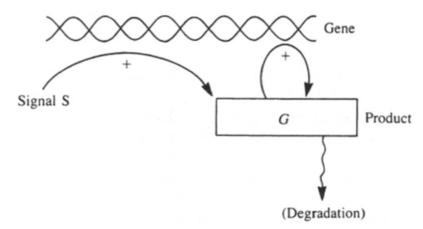
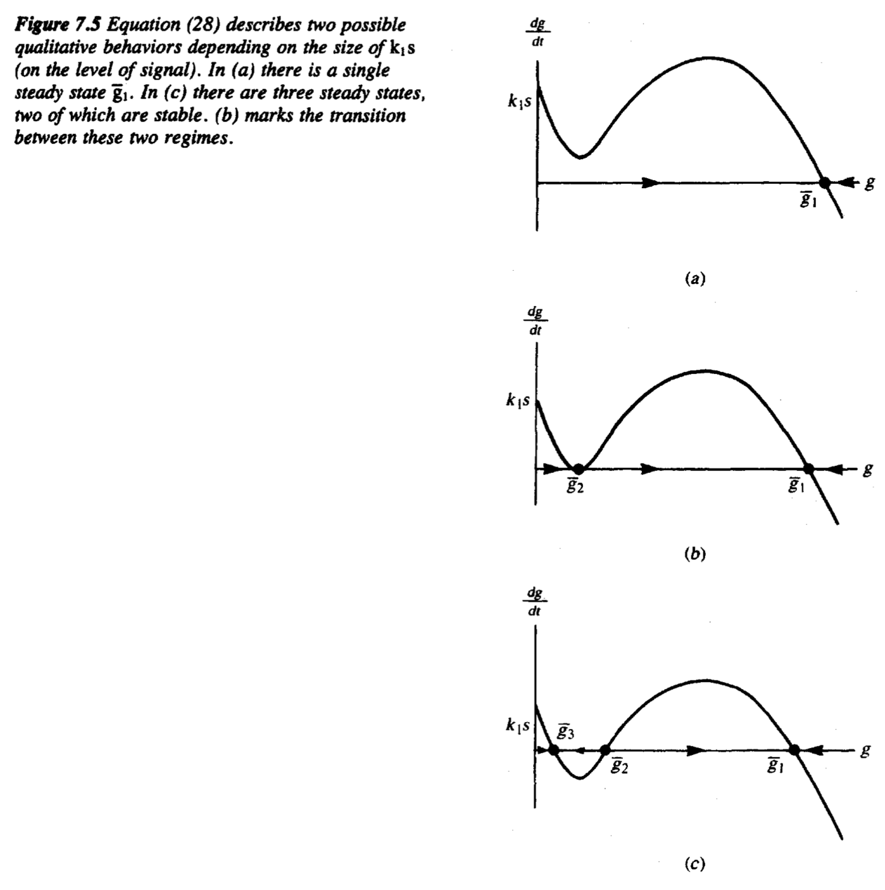
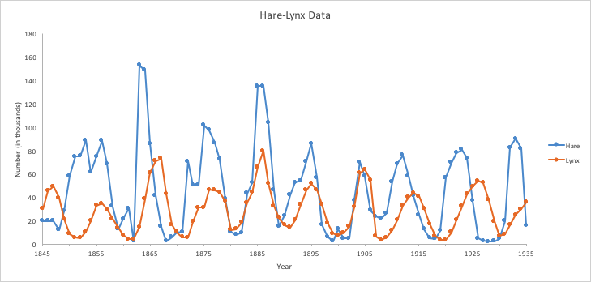
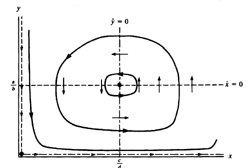
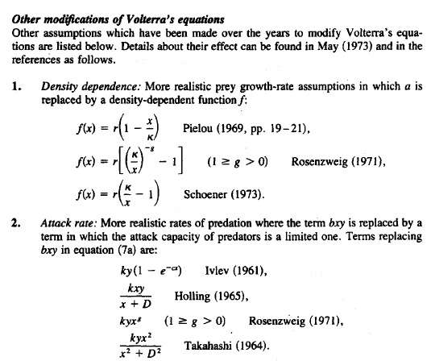
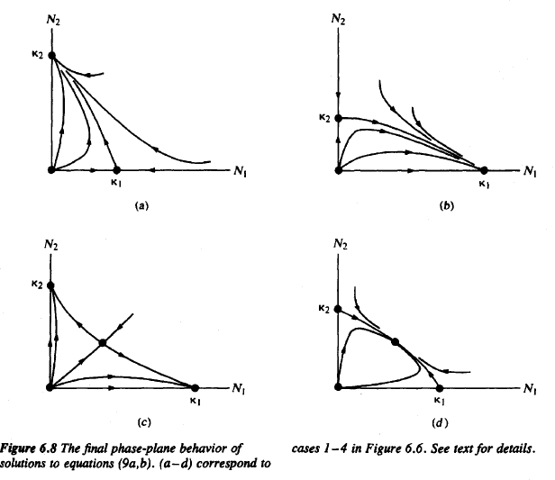
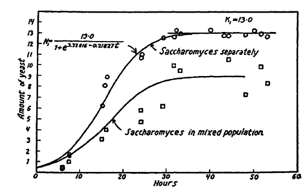
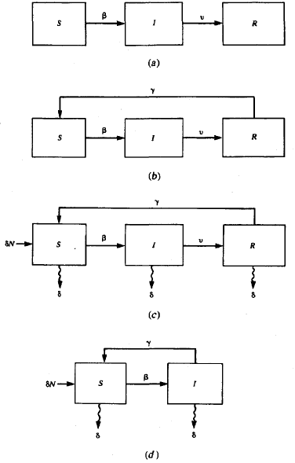
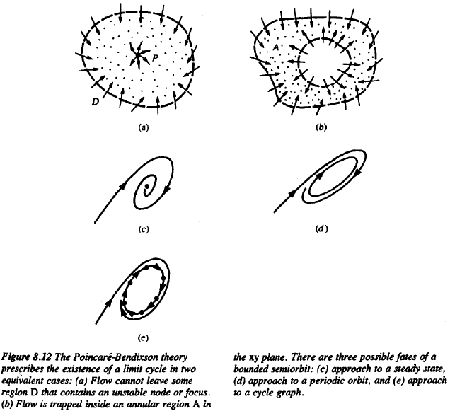
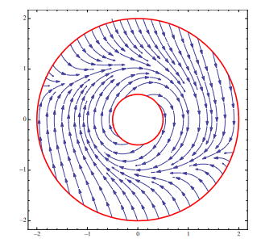

# Math 113B - Math Biology, W23

## Part 2

### Chapter 7 - Molecular Events

- The class voted to skip chapter 6 (for now) and go straight to chapter 7. That's fine by me, but if your project interest is in population or epidemiology models, you should skim chapter 6! 
- I will try to keep the biology background to a minimum for this but if you know more biology, I am happy to tell you some more specifics. I will say stuff like "a protein" rather than any specific protein because most of these principles apply to many. 

### A model of cell signaling (or enzyme kinetics)

- I learned this model as one of enzyme kinetics, but I think this story is nicer. It turns out the math is all the same. 
- This is a good warmup for more complex biochemical models. Now we've learned a lot of standard tools for analysis (e.g., phase-plane), we can go back to constructing and analyzing models.
- Lots of cells receive signals from their environment. Bacteria eat food and swim so that they can find more food. Cancer cells move and metastize in a particular direction. The list goes on. Let's mostly focus on the first one. 
- 

- The way many cells receive these external signals is through cell-surface "receptors". Imagine satellite dishes. The nutrients (or food), sometimes called "ligands" randomly wiggle around due to diffusion and arrive at the receptors. 

- If there is more food, there are more arrivals to receptors. This is therefore a way to measure the environment. Each receptor is either "bound" with a ligand or unbound. Typically, the cell wants to do something in response to these arrivals, so let's imagine that while the receptor is bound, the cell produces a product. We won't go into this product much but let's just think of this as: $C$ is the input and $P$ is the output. If these are the rules of how a cell operates: what mathematical relationship determines how changes in $C$ determine changes in $P$? 

- We want to write down differential equations for this! To do so, I want to first write down our assumptions in "chemical reaction" notation. This is very common in the construction of math models in biology, since many of these correspond to chemical events. 

- One way to write our model is $C + X_0 \overset{k_1}{\underset{k_{-1}}{\longleftrightarrows}} X_1 \overset{k_2}{\rightarrow} P + X_0$.  Note that is **not** a mathematical equation but rather a chemical reaction schematic. 

- How do we interpret this? It says that a $C$ and $X_0$ molecule come together at rate $k_1$ and they form $X_1$. This corresponds to a ligand binding to a receptor. This reaction is actually "reversible" so the ligand can pop out of the receptor, and this occurs at rate $k_{-1}$. The minus sign here is meaningless except that we are trying to convey this is the "reverse" of the reaction at rate $k_1$. 

- Then, while the receptor is bound, at rate $k_2$, the product is formed (and the ligand is eaten). How do I know that last part? Note that we do not get a $C$ back. We just get an unbound receptor back. Basically we are turning $C$ into $P$ with the help of a receptor. 

- Is there another name for a reaction of turning one molecule into another with the help of an intermediate? This is a classic **enzyme** reaction. 

- Your typical enzyme catalysis reaction describes a *substrate* converting into a *product*. 

  

- Note this is exactly the same. The "complex" is just the bound state in our model. I only mention this because you can find a similar explanation to this chapter in other textbooks but they will probably refer to enzyme kinetics rather than ligands and receptors, but the math ends up being the same. 

- We need one more ingredient to write down equations. The law of "Mass Action", from chemistry. It basically answers how to take the reaction schematic and turn it into a differential equation. 

- The **Law of Mass Action** says that if you have the scheme $A + B \overset{k}{\longrightarrow} C$ then the rate at which this reaction occurs is $k A B$ where $A,B$ are the concentrations of each of these molecules (an abuse of notation, since I am calling the molecules themselves and their concentrations the same thing). So for this reaction, we could write down ODEs $dA/dt = -kAB$ $dB/dt=-kAB$ and $dC/dt=kAB$. Of course these ODEs are not very interesting themselves but we can use this as a building block for more complicated systems like our ligand-receptor. 

- Based on this, what do we need for our model? 4 quantities. Each concentrations. $c, p, x_0, x_1$ are the concentrations of the ligand (nutrient), product, and unbound and bound receptors. Using the law of mass action to write down the terms, our system becomes 
  $$
  \frac{dc}{dt} &= -k_1 c x_0 + k_{-1} x_1 \\
  \frac{dx_0}{dt} &= -k_1cx_0  + k_{-1} x_1 + k_2 x_1\\
  \frac{dx_1}{dt} &=   k_1 cx_0 -k_{-1} x_1 -  k_2 x_1\\
  \frac{dp}{dt} &=   k_2 x_1.
  $$

- This is our model! Note that even the most basic chemical reactions give us a non-linear system of differential equations, hence why we spent so much time studying these types of objects at the beginning of our class.

- Another important technical point: what units do our rates have? There are different types of rates! If you do a units check, $k_2$ has units of 1/time. But I also called $k_1$ a rate. Was that right? Sorta. If you unit check. $k_1$ has units of 1/(concentration * time). The difference is that $k_2$ corresponds to a "unimolecular" reaction, whereas $k_2$ corresponds to a "bimolecular" reaction. You can't directly compare unimolecular reaction rates to biomolecular reaction rates. They don't even have the same units! This is a common mistake I see even by much more experienced people. 

- What do we want to do with this model? We could simulate it in Python. Or maybe we can say something more interesting about its behavior. Unfortunately right now, it's quite complicated. 4 differential equations. We are comfortable with 2. Can we simplify any? Yes! With a few cute observations.

- What does it mean for a system of differential equations to be "coupled"? It means that you can't separate it into separate parts. If you look at the equations, you'll eventually see that we do not need to know $p$ to know the other quantities. That is, $p$ is "downstream", and we could figure it out after figuring out $x_0, x_1, c$. However, we can't disentangle these 3 as obviously... 

- We can make another cute observation. What is $dx_0/dt + dx_1/dt$?  Integrate both sides of the equation $dx_0/dt + dx_1/dt = 0$ and we find $x_0(t)+x_1(t)=r$, some constant. Does this make sense? Yes! (At least in our model, maybe not reality), the number of receptors is **conserved**. This means we don't need 2 differential equations because at any time, if we know one of these quantities, we know the other. 

- Let's eliminate $x_0$ by noting that now we know $x_0 = r- x_1$. This leaves us with two differential equations.
  $$
  \frac{dc}{dt} &= -k_1 c (r-x_1)+ k_{-1} x_1 \\
  \frac{dx_1}{dt} &=   k_1 c(r-x_1) -k_{-1} x_1 -  k_2 x_1.
  $$

- Depending on what we wanted to answer, we could do phase-plane on this and look for equilibria and so on. However, historically, people ave taken a different approach. 

- A common feature in a lot of biological systems is the **separation of time scales**. What I mean by this is that some stuff happens very fast, some stuff happens very slowly. 

- There is a way to make this argument more precise called **quasi-steady state** but we will do it here like physicists: very non-rigorously. 

- In this particular setup, the receptors binding and unbinding is much faster than anything else in the system. Therefore, under this assumption, we can set $d x_1/ dt=0$. If we do this, we get 
  $$
  \frac{dx_1}{dt} =  0 =   k_1 c(r-\tilde{x}_1) -k_{-1} \tilde{x}_1 -  k_2 \tilde{x}_1.
  $$
  I am using $\tilde{x}_1$ because this is not quite an equilibrium, but more of a "quasi-equilibrium". It's like finding the nullcline for $x_1$. After some algebra, you can see this is achieved when 

  $$ \tilde{x}_1 = \frac{k_1 r c}{k_{-1}+k_2+k_1c}.$$

- Now we assume that $x_1 \to \tilde{x}_1$ much faster than $c$ evolves, so we can replace $x_1$ by $\tilde{x}_1$ in the $c$ equation and what are we left with? 
  $$
  \frac{dc}{dt} = -k_1 c (r-\tilde{x}_1)+ k_{-1} \tilde{x}_1 =- \frac{c k_1 k_2 r}{c k_1 + k_{-1} + k_2}.
  $$

- Did we gain anything from this? Yes! We have a self-contained equation for $c$. But importantly, we want to note the form of the equation. Let's lump together parameters. Call $k_\max = k_2 r$ and call $k_n = (k_{-1}+k_2)/k_1$. Then we can write this as 
  $$
  \frac{dC}{dt} = -\frac{k_\max c}{c+k_n}.
  $$

- Does this look familiar? This was exactly the food-dependent birth rate we took for bacteria early in the class. This form is called a **Michaelis-Menten** rate. 

- When constructing a model, if it is known that a reaction is enzymatic, people will often skip the step of writing down the enzyme (because you don't really care about it), and just model the reaction as a Michaelis-Menten rate. 

- It has lots of nice features that we discussed before. At $c=0$ there are no reactions, at large $c$ you saturate to some value (when the receptors are full even if you have tons of food). 

- To me, this is what math biology is all about. Connecting scales and assumptions. We have now just connected a molecular scale model of how bacteria eat food with one that you can use in a more zoomed-out model with multiple bacteria. 

- The equilibria of this system actually aren't that interesting. It's just $\bar{c}=0$. But we did importantly learn where Michaelis-Menten rates come from. I suspect at least some of the papers you all will read for your projects involve "Michaelis-Menten rates". 

  ### Variants on Michaelis-Menten, cooperativity

- Our enzyme reaction (receptors) here involved a single ligand binding, but there are lots of examples in biology where multiple substrates/ligands are required to bind before a complex forms and then product is made. How does this affect the rate at which the product forms? 

- Consider the reaction scheme 
  $$
  2C + X_0 \overset{k_1}{\underset{k_{-1}}{\longleftrightarrows}} X_2 \overset{k_2}{\rightarrow} 2P + X_0
  $$

- This is the setup where we need 2 ligands binding to a receptor before it is able to start making products. This might seem weird but think about something as simple as water = two of one molecule and one of another. 
- Note that now $k_1$ is actually a trimolecular reaction rate. We are still assuming that products are downstream and the total number of receptors is conserved, so we still can eliminate 2 equations and we are left with 

$$
\frac{dc}{dt} &= -k_1 c^2 x_0 + k_{-1} x_2 \\
\frac{dx_0}{dt} &=  - k_1 c^2 x_0 -k_{-1} x_2 -  k_2 x_2.
$$

- I did include a bit of secret sauce here. Because we need two $c$ molecules, the mass-action term corresponds to $c^2$. Otherwise, the whole idea is the same. It doesn't matter if we eliminate $x_2$ or $x_0$. After we do the same trick and assume that binding and unbinding is much faster than the concentration changes, we ultimately find 
  $$
  \frac{dc}{dt} = - \frac{k_\max c^2}{k_n+c^2},
  $$

- where $k_\max = k_2 r$ and $k_n = (k_{-1}+k_{2})/k_1$ again. If we draw this, it is roughly the same graph but has a much sharper transition. 

- This is interesting but maybe a little unrealistic, right? Can 2 molecules instantly find the enzyme at once? Maybe we need to have a more realistic model. Consider instead the reaction scheme 
  $$
  C + X_0 \overset{k_1}{\underset{k_{-1}}{\longleftrightarrows}} X_1 \overset{\kappa_1}{\rightarrow} P + X_0\\ 
  C + X_1 \overset{k_2}{\underset{k_{-2}}{\longleftrightarrows}} X_2 \overset{\kappa_2}{\rightarrow} P + X_1
  $$

- This is a bit more realistic. Now it says that our enzyme/receptor can either have 0, 1, or 2 molecules bound to it. 

- We can write down the differential equations for this. They're quite messy, but we know the algorithmic process! 
  $$
  \frac{dc}{dt} &= -k_1 c x_0 + k_{-1} x_1 - k_2 cx_1 + k_{-2}x_2 \\
  \frac{dx_0}{dt} &= -k_1cx_0  + k_{-1} x_1 + \kappa_1 x_1\\
  \frac{dx_1}{dt} &=   k_1 cx_0 -k_{-1} x_1 -  k_2 cx_1 + k_{-2} x_2  \kappa_1 x_1\\
  \frac{dx_2}{dt} &=   k_2 cx_1 -k_{-2} x_2 -  \kappa_2 x_1\\
  \frac{dp}{dt} &=   \kappa_1 x_1 + \kappa_2 x_2 .
  $$
  
- Yet again, we can go through the similar analysis where we note that the total number of receptors is still conserved, so $x_0+x_1+x_2=r$, and the products are downstream, so we can eliminate almost all of our equations. Now we can only eliminate $x_0$ but then we can make the **quasi-steady-state** assumption $dx_1/dt=0$ and $dx_2/dt=0$ and we are left with an ugly ODE for $c$ of the form 
  $$
  \frac{dc}{dt} = \frac{-rc(\kappa_1 K_m'+\kappa_2c)}{K_mK_m' + K_m'c+c^2},
  $$

- where $K_m = (\kappa_1+k_{-1})/k_1$ and $K_m' = (\kappa_2+k_{-2})/k_2$. 

- This looks quite a bit different than our first result! When are they equivalent? 

- The middle term in the denominator vanishes when $K_mK_m' \gg K_m' c$ and also $c^2 \gg K_m'c$. Putting these together, we get $K_m \gg c \gg K_m'$. This just means that $K_m > K_m'$. Let's return back to the original quantities to make sense of this. It says 
  $$
  \frac{k_2}{\kappa_2 + k_{-2}} > \frac{k_1}{\kappa_1 + k_{-1}}.
  $$

- Can we make sense of this? Yes! It basically says that the tendency is for the reaction to make *forward progress*. That is, so long as it is fairly infrequent that a ligand pops off before another one binds, then we are roughly in the same scenario when we assumed 2 bind at once. It's a little weird though. It's a bit stronger than that. It says that actually the second binding must be *faster* than the first, in some sense. 

- This actually happens in reality! Hemoglobin is like this (with 4 units). After 1 oxygen molecule binds, the hemoglobin changes shape and makes it more likely for others to bind after. This is called **cooperative binding**. 

- In general, if we have "cooperative binding" of $N$ molecules binding to an enzyme, the result we get follows the same pattern, we get a reaction rate of 

  $$k_\text{M-M}(c) = \frac{k_\max c^N}{k_n+c^N}.$$

  What is the lesson here? Cooperative binding produces "sharper" responses in biology. 

- Many papers will assume this form because it leads to more interesting behavior but lacks a molecular explanation. Unless you have reason to believe that 2 molecules are binding at one time, there is really no sincere justification to include this. 

  ## Genetic switch

- Let's use the Michaelis-Menten rate in a model of something else. 

- We talk about genes being "on" or "off", or "expressed" or "not expressed". These are very binary descriptions. Yet, many things we talk about in our class are concentrations. How do you get such binary behavior from these ingredients? This is a **very simple** model that explains it. There are many interesting variants and this is just meant to be a "toy" warmup to these ideas.

  

- $$
  \frac{dg}{dt} = k_1 s - k_2 g + \frac{Kg^2}{k_n + g^2}.
  $$

- Call the whole right hand side $dg/dt = f(g)$. What are the possible behaviors? 

- 

  

- How did we get these drawings? Superimpose the parts of $f$: $k_1s$ is just a constant that shifts the curve up or down $-k_2g$ is a decreasing line, and the last term is a “sigmoid” or an S-shaped curve. 

- If you add these up, you get the shapes you see above and depending on the signal level $s$ you can get 3 equilibria, with 2 being stable! This is a “gene toggle” or a “toggle switch”. 

- Also interestingly, if you give a cell a high $s$ and then remove it, it stays on! This is a form of cellular “memory”. 

- Note the special sauce of this model: a (very) non-linear, positive feedback term. 

- We can figure this out without even really needing to calculate anything. This is why I tried to convey at the beginning of our class that I believe this is more of a "philosophy" of thinking about biology rather than a specific technical skillset. Yes, of course there are some technical skills, but I would rather you start thinking this way than be able to do hard calculations! 

## Chapter 6 - Population Models

- Why are population models interesting? Let’s start with the most famous figure in math biology (I think). 

- In the 1800s and 1900s, a company called the Hudson Bay Company of Canada acquired pelts of both lynxes and snowshoe hairs. The number of pelts they retrieved in a year we can use as a proxy for the total population of each species. 

  

- They took this data over 90 years and found really interesting trends: oscillations!

- If you were in a bad year you might think that the species were going extinct, but we clearly see they were not.

- What causes these oscillations? Is it the hunting? Weather? Can we explain it, to get a better idea of what controls the populations?

- These are called “predator-prey” models.

### Predator-Prey

- The most classical model of predator-prey are called the “Lotka-Volterra” equations. We’ll derive and analyze them here. Originally, Volterra wanted to understand why fish populations seemed to oscillate in the Mediterranean (he was Italian).

-  Here are the most basic assumptions:

  - Prey grow in an unlimited way when predators do not keep them under
    control.
  - Predators depend on the presence of their prey to survive.

  - The rate of predation depends on the likelihood that a victim is encountered by
    a predator.

  - The growth rate of the predator population is proportional to food intake (rate
    of predation

- We can translate this into a mathematical model for $x$, the prey (hares), and $y$ the predators. 
  $$
  dx/dt = ax - bxy,    \qquad dy/dt = -cy + dxy.
  $$

- What do the parameters represent? $a$ is the birth rate of the prey, and $b$ is how quickly they interact. $c$ is the natural death rate of the predators, and $d$ is how much offspring they get from interacting.

- The parameters $b,d$ are a little odd but you can think of it as $b/d$ is the efficiency of predation: the efficiency of converting 1 unit of prey into predator. 

- Let’s turn the crank on our linear stability analysis! We have two equilibria, $(0,0)$ and $(c/d, a/b)$. The Jacobian is always $J=\begin{bmatrix} a-by & -bx \\\ dy & dx-c\end{bmatrix}$.  Plugging in our two equilibria, we find $J = \begin{bmatrix} a & 0 \\ 0 & -c \end{bmatrix}$ and $J= \begin{bmatrix} 0 & -bc/d \\ da/b & 0 \end{bmatrix}$. These have eigenvalues $\lambda_{1,2} = a,-c$ and for the first (a saddle) and $\lambda_{1,2} = \pm \sqrt{ca} i$ for the second ( a center). 

- These results are a little weird. Note that the steady state of the prey isn’t even determined by any of its parameters but rather $c/d$, parameters associated with the predator. 

- What controls the oscillations? When $ca$ is larger, the lifespan is shorter so the oscillations become faster. 

  

- This model is a little unrealistic since the prey grow without bound. Suppose instead we change the $x$ equation to be $dx/dt = ax(K-x)/x - bxy$.  Now the prey have a max population. What happens in this case? This will be the homework question. 

- You’ll note we were a little shady about how to prove this was really oscillatory behavior, but we’ll study this in more depth next chapter. 

- There are many variants on Lotka-Volterra! 

  ### Species in competition

  

- Instead of predator-prey, we could ask: what if two species are in competition for the same food? 

- This is also originated by Lotka-Volterra, and sometimes called “competitive Lotka-Volterra”. 
  $$
  \begin{aligned}
  \frac{d N_1}{d t} & =r_1 N_1 \frac{\kappa_1-N_1-\beta_{12} N_2}{\kappa_1} \\
  \frac{d N_2}{d t} & =r_2 N_2 \frac{\kappa_2-N_2-\beta_{21} N_1}{\kappa_2}
  \end{aligned}
  $$

- The motivation for this is typical logistic growth: $dx/dt = rx(K-x)/K$ where $K$ is the carrying capacity and $r$ is the intrinsic growth rate. Now, the second term gets modified by both populations because they are competing for food in the same environment. 

- We won’t do the analysis in-class but you can see your book if this sounds cool. It turns out, depending on parameters, you can get co-existence or winner-takes-all.

  

- This is important because, for instance, many microbiological species are competing for food. For instance, there are famous studies in yeast:

  

- You can see that one at a time, the populations grow larger, but in competition they steady-state to a lower value. This is co-existence.

### Infectious disease models

- Suppose we wanted to model an epidemic. Let’s start with a model for a viral infection. Call $x$ the population of healthy individuals (the hosts) and $y$ the viral population. 

-  For simplicity, let’s start with the assumptions

  1. There is a constant human birth rate $\alpha$.

  2. Viral infection causes an increased mortality due to disease, so $g(y) > 0$.
  3. Reproduction of viral particles depends on human presence.
  4. In the absence of human hosts, virus particles "die" or become nonviable at
    rate $\gamma$.

- Putting these together, we get 
  $$
  \begin{aligned}
  & \frac{d x}{d t}=[\alpha-g(y)] x \\
  & \frac{d y}{d t}=\beta x y-\gamma y .
  \end{aligned}
  $$

- In particular, if we take $g(y) =y$, we get back **exactly** Lotka-Volterra! 

- So this isn’t that helpful. Instead, we want to keep track of individuals being infected or not.

- These date back to **Kermack-MacKendrick**  and keep track of **susceptible** and **infected** individuals (called an **SI** model), or SI and **recovered** (called **SIR**), or maybe some other population too. We can draw diagrams based on how we think the disease progresses.
  

- Let’s study (a) first. These equations then are 
  $$
  \begin{aligned}
  & \frac{d S}{d t}=-\beta I S, \\
  & \frac{d I}{d t}=\beta I S-\nu I, \\
  & \frac{d R}{d t}=\nu I .
  \end{aligned}
  $$

- They share the nice property that $N=S+I+R$ is conserved. 

- Probably more realistic is (b), SIRS where recovered can become susceptible again. 

- If you do the analysis on this one, you find that there are two steady states: a disease-free state, and a diseased state. Ultimately the linear stability analysis gives you that the disease will **not** die out if $N\beta/\nu>1$. How do we interpret this? Sometimes this is called $R_0$. Although not totally obvious, this is effectively the number (on average), one individual will infect. How do we see this? $\beta/\nu$ is the fraction of the population that will come into contact with an infected individual. 

- There are endless variations on these, depending on the disease you are interested in.
- There’s also more modern questions of: how do you even estimate $R_0$? 
- How do vaccines play into this? Are all individuals the same? 

## Chapter 8 - Oscillations, rhythms in biology

- I want to at least mention this last chapter because I think the math is a little different. Linear stability analysis and nullclines do not quite get us all the way there to understand oscillations.

- Yet, oscillations are everywhere in biology. Circadian rhythms, your heartbeat, brain waves, and so on. 

- I am going to do this a little out of order. I think it’s easiest to see the math tools first, and then we’ll work on the actual models.

- For this whole chapter we want only 2D things, so $dx/dt = F(x,y)$ and $dy/dt = G(x,y)$. 

- **Existence of periodic solutions** can be boiled down to:

   ``` If you can find a region in the xy phase plane containing a single repelling steady state(i.e. unstable node or spiral) and show that the arrows along the boundary of the region never point outwards, you may conclude that there must be at least one closed periodictrajectory inside the region.```

- This is called the Poincare-Bendixson theorem. It is somewhat intuitive! 

  

  

- Basically if there is nowhere for the trajectory to go, it must oscillate. Unfortunately, actually checking this is a bit tough. So there are two concrete ways to **rule out** this possibility.

- **Bendixson's criterion:** Suppose $D$ is a simply connected region of the plane (that is, $D$ is a region without holes). If the expression $\partial F/\partial x + \partial G/ \partial y$ is not identically zero (i.e. is not zero for all $(x, y) \in D$) and does not change sign in $D$ , then there are no closed orbits in this region.

- **Dulac's criterion:** Suppose $D$ is a simply connected region in the plane, and suppose  there exists a function $B(x, y)$, continuously differentiable on $D$, such that the expression $\partial(Bf)/\partial x + \partial (By)/\partial y$ has the same sign anywhere in $D$, then there are no closed orbits in this region. 

- Let’s do an example or two. 
  $$
  \begin{array}{r}
  x^{\prime}=x-y-x\left(x^2+y^2\right) \\
  y^{\prime}=x+y-y\left(x^2+y^2\right)
  \end{array}
  $$

- If we convert to polar coordinates, we get $r’ = r(1-r^2)$ and $\theta’ = 1$. We want to construct a region $K$ that satisfies the PB theorem. Take the annulus from $r=1/2$ to $r=2$. Check $r’<0$ for outer and $r’>0$ for inner. We’re done! 

  


